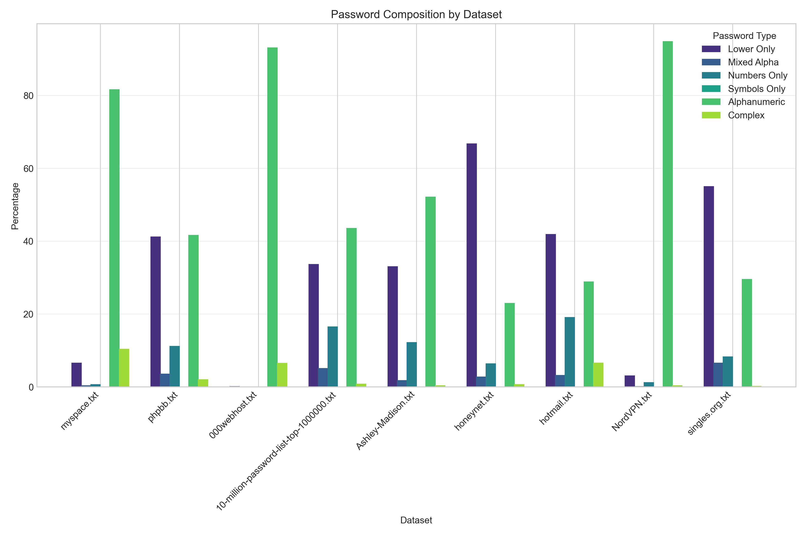
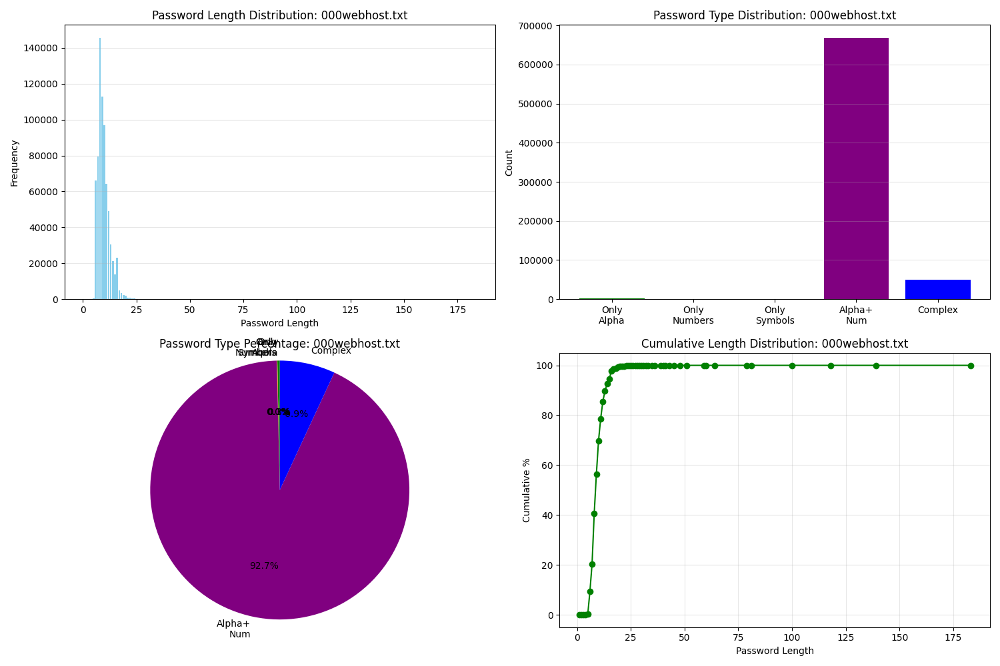
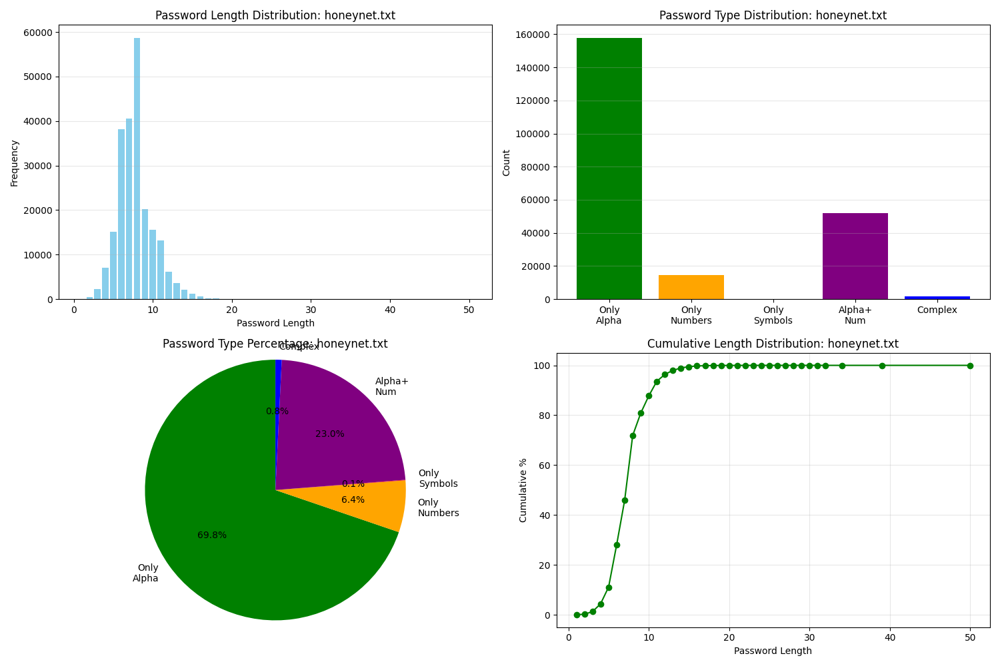
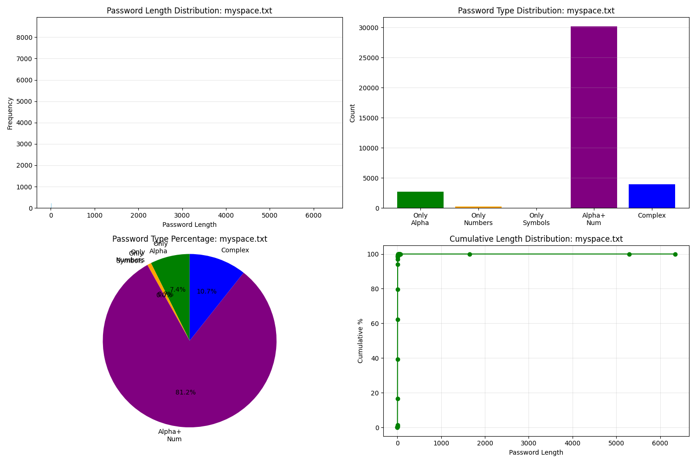
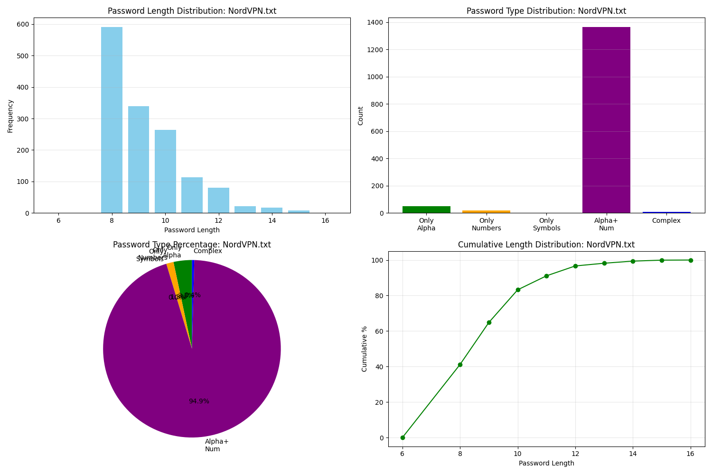
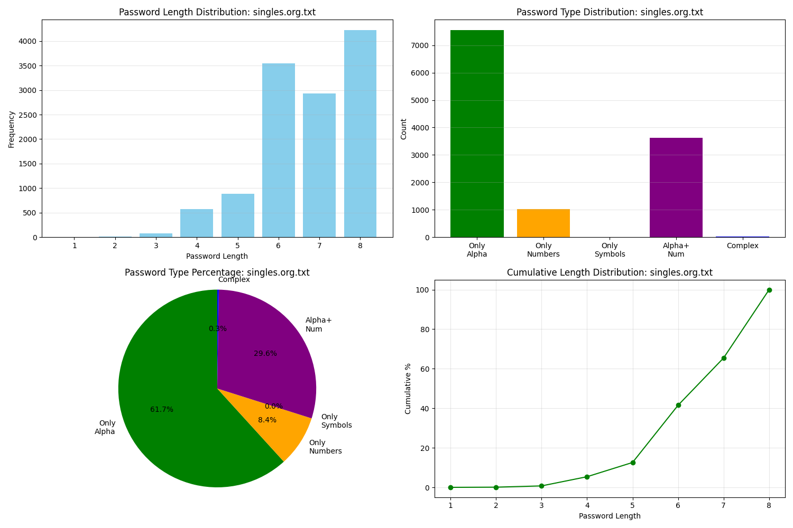
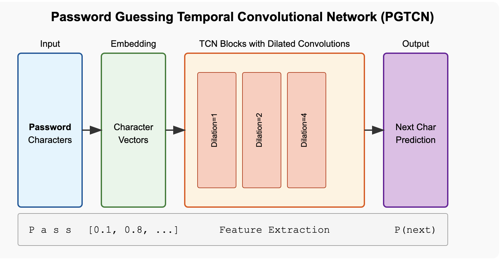

# **Datasets Distribution**

## **Parthav**
- myspace.txt
- honeynet.txt
- 10-million-password-list

## **Akshay**
- rockyou.txt
- phpbb.txt
- singles.org.txt

## **Aaqib** 
- hotmail.txt
- 000webhost.txt

## **Yogesh**
- Ashley-madison.txt
- NortVPN.txt

# **Analysis Graph**
## password length histograms

## password category comparison

# Analysis on individual password datasets
## 1. 000webhost

## 2. 10-million-password-list-top-1000000

## 3. Ashley-Madison

## 4. honeynet 

## 5. hotmail 

## 6. myspace

## 7. NordVPN

## 8. phpbb

## 9. rockyou

## 10. singles.org

# PGTCN Architecture
 
